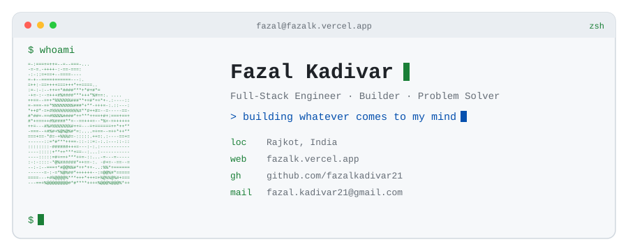
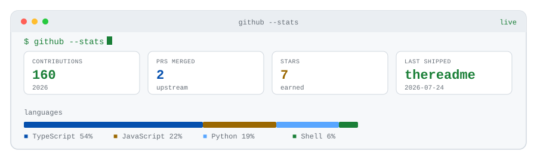

<picture>
  <source media="(prefers-color-scheme: dark)" srcset="./assets/hero-dark.svg" />
  
</picture>

I build software for the joy of it — especially around AI — and share the messy middle in open source. Serious about craft, unserious about taking myself too seriously.

[web](https://fazalk.vercel.app) · [twitter](https://x.com/fazalkadivar21) · [email](mailto:fazal.kadivar21@gmail.com) · [github](https://github.com/fazalkadivar21)

---

### Featured

- **[Fazalkadivar21/onlyapp](https://github.com/Fazalkadivar21/onlyapp)** · TypeScript  
  Unified AI workspace for building and talking to your tools in one place
- **[Fazalkadivar21/Relay](https://github.com/Fazalkadivar21/Relay)** · Python  
  Compatibility layer between Claude Code workflows and ChatGPT
- **[Fazalkadivar21/chatGPT-clone](https://github.com/Fazalkadivar21/chatGPT-clone)** · TypeScript · ★ 2  
  Full-stack Gemini-powered chat app from the build-in-public grind
- **[Fazalkadivar21/starboy](https://github.com/Fazalkadivar21/starboy)** · JavaScript · ★ 3  
  CLI to scaffold projects with a live reload dev mode
- **[Fazalkadivar21/omegle](https://github.com/Fazalkadivar21/omegle)** · TypeScript  
  Omegle-style random chat clone with NSFW protection

### Also active

- **[Fazalkadivar21/thereadme](https://github.com/Fazalkadivar21/thereadme)** · TypeScript · ★ 2  
  Self-updating GitHub profile README generator
- **[Fazalkadivar21/Fazalkadivar21](https://github.com/Fazalkadivar21/Fazalkadivar21)**  
  my personal repo
- **[Fazalkadivar21/Zeni](https://github.com/Fazalkadivar21/Zeni)** · TypeScript  
  Track your earning goals with progress rings and a home screen widget.

### Activity

<picture>
  <source media="(prefers-color-scheme: dark)" srcset="./assets/activity-dark.svg" />
  
</picture>

### Merged upstream PRs

- [fix(browser): unstick Ctrl+Tab switcher when opened from a focused browser guest](https://github.com/stablyai/orca/pull/9966) — `stablyai/orca` · 2026-07-24
- [fix: prevent initial right-click from selecting a context menu item](https://github.com/pingdotgg/t3code/pull/3877) — `pingdotgg/t3code` · 2026-07-17

---

Last updated: 2026-07-30T08:06:46Z · generated by [thereadme](https://github.com/fazalkadivar21/thereadme)
